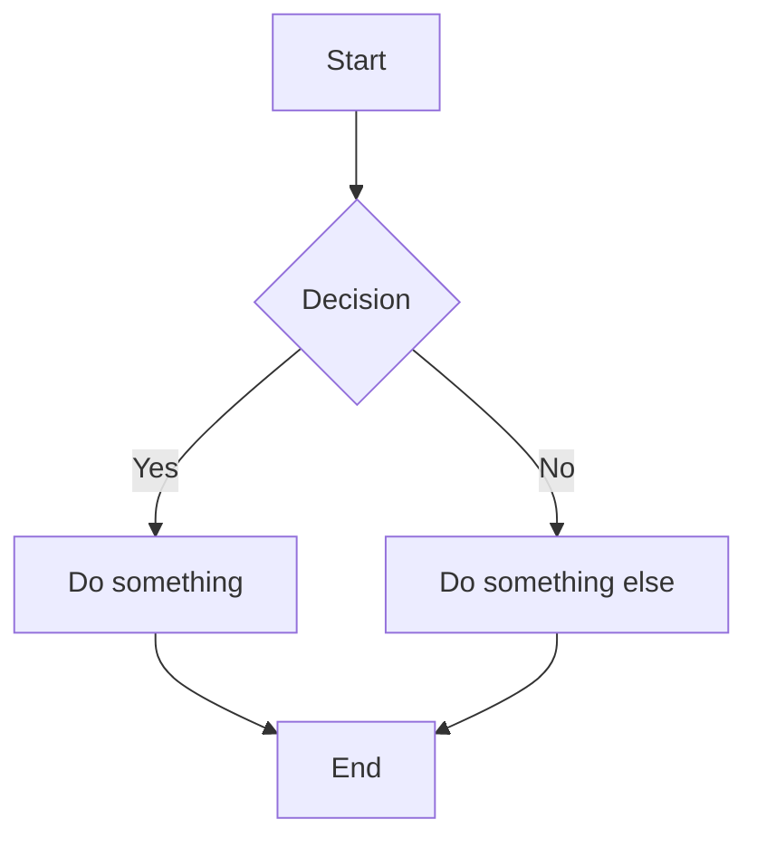

# Markdown Feature Reference

A practical guide to every Markdown feature used in `artemis-program.md`, with syntax examples and notes on compatibility.

---

## Table of Contents

- [Headings](#headings)
- [Paragraphs and Line Breaks](#paragraphs-and-line-breaks)
- [Text Formatting](#text-formatting)
- [Blockquotes](#blockquotes)
- [Lists](#lists)
- [Task Lists (Checkboxes)](#task-lists-checkboxes)
- [Links](#links)
- [Images](#images)
- [Code](#code)
- [Tables](#tables)
- [Horizontal Rules](#horizontal-rules)
- [Footnotes](#footnotes)
- [Math (LaTeX)](#math-latex)
- [Mermaid Diagrams](#mermaid-diagrams)
- [GitHub-Style Alerts](#github-style-alerts)
- [Collapsible Sections](#collapsible-sections)
- [Definition Lists](#definition-lists)
- [Emoji](#emoji)
- [HTML in Markdown](#html-in-markdown)
- [Comments](#comments)
- [Compatibility Notes](#compatibility-notes)

---

## Headings

Use `#` symbols at the start of a line. More `#` symbols = smaller heading.

**Syntax:**

```markdown
# Heading 1
## Heading 2
### Heading 3
#### Heading 4
##### Heading 5
###### Heading 6
```

**Notes:**
- Most documents use H1–H3. H4–H6 exist but are rarely needed.
- Always put a space after the `#`.
- Use only one H1 per document (it's your title).

---

## Paragraphs and Line Breaks

Paragraphs are separated by a blank line. A single newline within text does *not* create a line break in most renderers.

**Syntax:**

```markdown
This is the first paragraph.

This is the second paragraph.
```

To force a line break without starting a new paragraph, end a line with two spaces or use `<br>`:

```markdown
Line one with two trailing spaces  
Line two appears directly below.

Line one with a break tag<br>
Line two appears directly below.
```

---

## Text Formatting

**Syntax:**

```markdown
**bold text**
*italic text*
***bold and italic***
~~strikethrough~~
`inline code`
```

**Renders as:**

- **bold text**
- *italic text*
- ***bold and italic***
- ~~strikethrough~~
- `inline code`

**Notes:**
- You can also use underscores (`_italic_`, `__bold__`) but asterisks are more common and work in more contexts (e.g., mid-word).
- Strikethrough (`~~`) is a GitHub Flavored Markdown (GFM) extension — not part of the original spec.

---

## Blockquotes

Prefix lines with `>`. You can nest them and combine with other formatting.

**Syntax:**

```markdown
> This is a blockquote.

> This is a multi-line blockquote.
> It continues on the next line.

> **Nested blockquote:**
>
> > This is indented one level deeper.
```

**Renders as:**

> This is a blockquote.

> This is a multi-line blockquote.
> It continues on the next line.

> **Nested blockquote:**
>
> > This is indented one level deeper.

---

## Lists

### Unordered Lists

Use `-`, `*`, or `+` followed by a space. Indent with two or four spaces for nesting.

```markdown
- Item one
- Item two
  - Nested item
  - Another nested item
    - Deeply nested
- Item three
```

- Item one
- Item two
  - Nested item
  - Another nested item
    - Deeply nested
- Item three

### Ordered Lists

Use numbers followed by a period. The actual numbers don't matter — Markdown auto-numbers them.

```markdown
1. First item
2. Second item
3. Third item
   1. Sub-item A
   2. Sub-item B
```

1. First item
2. Second item
3. Third item
   1. Sub-item A
   2. Sub-item B

**Notes:**
- You can use `1.` for every item and Markdown will still number them correctly.
- To include multiple paragraphs or code blocks inside a list item, indent them to align with the list content.

---

## Task Lists (Checkboxes)

A GFM extension. Use `- [ ]` for unchecked and `- [x]` for checked.

**Syntax:**

```markdown
- [x] Completed task
- [ ] Incomplete task
- [ ] Another incomplete task
```

**Renders as:**

- [x] Completed task
- [ ] Incomplete task
- [ ] Another incomplete task


**Notes:**
- On GitHub, these render as interactive checkboxes in issues and PRs.
- In most other renderers, they display as static checked/unchecked boxes.

---

## Links

### Inline Links

```markdown
[Link text](https://example.com)
[Link with title](https://example.com "Hover text")
```

[Link text](https://example.com)
[Link with title](https://example.com "Hover text")

### Anchor Links (Internal)

Link to a heading within the same document. The anchor is the heading text, lowercased, with spaces replaced by hyphens and special characters removed.

```markdown
[Jump to Tables](#tables)
[Jump to Budget & Funding](#budget--funding)
```

**Rules for anchor generation:**
- Lowercase everything
- Replace spaces with `-`
- Remove special characters except hyphens
- `&` becomes nothing, so "Budget & Funding" → `budget--funding`

### Autolinks

Most renderers automatically turn URLs into clickable links:

```markdown
https://www.nasa.gov
```

---

## Images

Same syntax as links, but prefixed with `!`.

**Syntax:**

```markdown


```

**Notes:**
- Alt text is important for accessibility — describe what the image shows.
- The title (in quotes) appears as a tooltip on hover.
- Markdown has no native syntax for image sizing. Use HTML if you need to control dimensions:

```html

```

---

## Code

### Inline Code

Wrap text in single backticks.

```markdown
Use the `print()` function to output text.
```

Use the `print()` function to output text.

### Fenced Code Blocks

Use triple backticks (` ``` `) with an optional language identifier for syntax highlighting.

````markdown
```python
def greet(name: str) -> str:
    return f"Hello, {name}!"
```
````

```python
def greet(name: str) -> str:
    return f"Hello, {name}!"
```

### Common Language Identifiers

| Identifier   | Language        |
|:-------------|:----------------|
| `python`     | Python          |
| `javascript` | JavaScript      |
| `typescript` | TypeScript      |
| `json`       | JSON            |
| `bash`       | Bash / Shell    |
| `html`       | HTML            |
| `css`        | CSS             |
| `sql`        | SQL             |
| `yaml`       | YAML            |
| `markdown`   | Markdown        |
| `mermaid`    | Mermaid diagram |

**Tip:** Use a plain code block (no language) for ASCII art or generic preformatted text:

````markdown
```
┌──────────┐
│  Box     │
└──────────┘
```
````

### Showing Backticks Inside Code Blocks

To display triple backticks inside a code block, wrap the outer fence with four backticks:

`````markdown
````markdown
```python
print("hello")
```
````
`````

---

## Tables

Tables use pipes (`|`) and hyphens (`-`). The separator row controls column alignment.

**Syntax:**

```markdown
| Left-aligned | Center-aligned | Right-aligned |
|:-------------|:--------------:|--------------:|
| Cell 1       | Cell 2         |        Cell 3 |
| Cell 4       | Cell 5         |        Cell 6 |
```

**Renders as:**

| Left-aligned | Center-aligned | Right-aligned |
|:-------------|:--------------:|--------------:|
| Cell 1       | Cell 2         |        Cell 3 |
| Cell 4       | Cell 5         |        Cell 6 |

**Alignment syntax in the separator row:**
- `:---` — left-aligned (default)
- `:---:` — center-aligned
- `---:` — right-aligned

**Notes:**
- Columns don't need to be visually aligned in the source — the pipes are what matter.
- You can use inline formatting inside cells: `**bold**`, `*italic*`, `` `code` ``, links, etc.
- Tables cannot contain block-level elements (lists, code blocks, etc.).

---

## Horizontal Rules

Three or more hyphens, asterisks, or underscores on a line by themselves.

```markdown
---
***
___
```

All three produce the same result. `---` is the most common convention.

---

## Footnotes

Define a footnote reference in the text and its content elsewhere in the document.

**Syntax:**

```markdown
This claim needs a source[^1].

Another reference[^note].

[^1]: Source details go here.
[^note]: You can use words as identifiers too.
```

**Notes:**
- Footnote definitions can go anywhere in the document — they always render at the bottom.
- Supported in GFM, Obsidian, Jekyll, Hugo, and most modern renderers.
- Not supported in all basic Markdown parsers.

---

## Math (LaTeX)

Render mathematical expressions using LaTeX syntax. Supported in GitHub, Obsidian, Jupyter, and many static site generators.

### Inline Math

Wrap with single `$`:

```markdown
The energy equation is $E = mc^2$.
```

The energy equation is $E = mc^2$.

### Block Math

Wrap with double `$$`:

```markdown
$$
F = G \frac{m_1 m_2}{r^2}
$$
```

$$
F = G \frac{m_1 m_2}{r^2}
$$

### Common LaTeX Syntax

| What you want       | Syntax                    | Result              |
|:---------------------|:--------------------------|:--------------------|
| Fraction             | `\frac{a}{b}`            | $\frac{a}{b}$      |
| Subscript            | `x_{i}`                  | $x_{i}$            |
| Superscript          | `x^{2}`                  | $x^{2}$            |
| Square root          | `\sqrt{x}`               | $\sqrt{x}$         |
| Summation            | `\sum_{i=1}^{n} x_i`    | $\sum_{i=1}^{n} x_i$ |
| Greek letters        | `\alpha, \beta, \Delta`  | $\alpha, \beta, \Delta$ |
| Approximately        | `\approx`                | $\approx$           |
| Less/greater or equal| `\leq, \geq`            | $\leq, \geq$       |


---

## Mermaid Diagrams

Mermaid is a diagramming language rendered from code blocks. Supported on GitHub, GitLab, Obsidian, and many documentation platforms.

**Syntax:**

````markdown

````

**Renders as a flowchart:**


### Common Diagram Types

| Type         | Keyword        | Use case                    |
|:-------------|:---------------|:----------------------------|
| Flowchart    | `graph TD`     | Process flows, decisions    |
| Sequence     | `sequenceDiagram` | API calls, interactions  |
| Class        | `classDiagram` | OOP class relationships     |
| Gantt        | `gantt`        | Project timelines           |
| Pie          | `pie`          | Proportional data           |
| State        | `stateDiagram` | State machines              |

**Learn more:** [mermaid.js.org](https://mermaid.js.org/)

---

## GitHub-Style Alerts

A GFM extension for callout boxes. Use a special blockquote syntax.

**Syntax:**

```markdown
> [!NOTE]
> Useful information that users should know.

> [!TIP]
> Helpful advice for doing things better.

> [!IMPORTANT]
> Key information users need to know.

> [!WARNING]
> Urgent info that needs immediate attention.

> [!CAUTION]
> Advises about risks or negative outcomes.
```

**Renders as colored callout boxes on GitHub:**

> [!NOTE]
> Useful information that users should know.

> [!TIP]
> Helpful advice for doing things better.

> [!IMPORTANT]
> Key information users need to know.

> [!WARNING]
> Urgent info that needs immediate attention.

> [!CAUTION]
> Advises about risks or negative outcomes.

**Notes:**
- These are GitHub-specific. Obsidian uses a different callout syntax: `> [!note]` (lowercase, with more types available).
- Other platforms may not render these — they'll appear as regular blockquotes with the tag text visible.

---

## Collapsible Sections

Use HTML `<details>` and `<summary>` tags. Works on GitHub, GitLab, and most modern renderers.

**Syntax:**

```markdown
<details>
<summary>Click to expand</summary>

Hidden content goes here. You can use **any Markdown** inside.

- List item one
- List item two

</details>
```

**Renders as:**

<details>
<summary>Click to expand</summary>

Hidden content goes here. You can use **any Markdown** inside.

- List item one
- List item two

</details>

**Notes:**
- Leave a blank line after `<summary>` for Markdown inside to render correctly.
- You can nest `<details>` blocks for multi-level collapsibles.
- Add the `open` attribute to have it expanded by default: `<details open>`.

---

## Definition Lists

Not part of standard Markdown, but supported via HTML in most renderers.

**HTML Syntax:**

```html
<dl>
  <dt>Term One</dt>
  <dd>Definition of term one.</dd>

  <dt>Term Two</dt>
  <dd>Definition of term two.</dd>
</dl>
```

**Renders as:**

<dl>
  <dt>Term One</dt>
  <dd>Definition of term one.</dd>

  <dt>Term Two</dt>
  <dd>Definition of term two.</dd>
</dl>

Some extended Markdown parsers (PHP Markdown Extra, Pandoc, Obsidian) support a native syntax:

```markdown
Term One
: Definition of term one.

Term Two
: Definition of term two.
```

This native syntax is **not** supported on GitHub.

---

## Emoji

### Unicode Emoji

Just paste emoji characters directly into your Markdown:

```markdown
🚀 Launch day! 🌕 See you on the Moon.
```

🚀 Launch day! 🌕 See you on the Moon.

### GitHub Shortcodes

GitHub and some other platforms support colon-wrapped shortcodes:

```markdown
:rocket: Launch day! :full_moon: See you on the Moon.
```

:rocket: Launch day! :full_moon: See you on the Moon.

**Notes:**
- Unicode emoji work everywhere. Shortcodes are platform-specific.
- Full shortcode list: [emoji-cheat-sheet.com](https://www.webfx.com/tools/emoji-cheat-sheet/)

---

## HTML in Markdown

Most Markdown renderers allow inline HTML for features Markdown doesn't natively support.

### Common HTML Elements in Markdown

```markdown
<!-- Subscript and superscript -->
H<sub>2</sub>O is water. E = mc<sup>2</sup>.

<!-- Keyboard keys -->
Press <kbd>Ctrl</kbd> + <kbd>C</kbd> to copy.

<!-- Centered text -->
<div align="center">
  Centered content here.
</div>

<!-- Colored text (GitHub doesn't support this) -->
<span style="color: red;">Red text</span>

<!-- Line break -->
Line one<br>Line two
```

**Renders as:**

H<sub>2</sub>O is water. E = mc<sup>2</sup>.

Press <kbd>Ctrl</kbd> + <kbd>C</kbd> to copy.

**Notes:**
- GitHub strips `style` attributes for security, so inline CSS won't work there.
- `<sub>`, `<sup>`, `<kbd>`, `<br>`, `<details>`, `<dl>` all work on GitHub.
- When mixing HTML and Markdown, leave blank lines between HTML blocks and Markdown content.

---

## Comments

HTML comments are invisible in rendered output. Useful for notes to yourself or other authors.

**Syntax:**

```markdown
<!-- This text won't appear in the rendered document -->

<!-- 
  Multi-line comments
  work too.
-->
```

---

## Compatibility Notes

Not all features work everywhere. Here's a quick compatibility matrix:

| Feature              | Standard MD | GitHub (GFM) | Obsidian | GitLab | Pandoc |
|:---------------------|:-----------:|:------------:|:--------:|:------:|:------:|
| Headings             | ✅          | ✅           | ✅       | ✅     | ✅     |
| Bold / Italic        | ✅          | ✅           | ✅       | ✅     | ✅     |
| Strikethrough        | ❌          | ✅           | ✅       | ✅     | ✅     |
| Tables               | ❌          | ✅           | ✅       | ✅     | ✅     |
| Task Lists           | ❌          | ✅           | ✅       | ✅     | ✅¹    |
| Fenced Code Blocks   | ❌          | ✅           | ✅       | ✅     | ✅     |
| Footnotes            | ❌          | ✅           | ✅       | ✅     | ✅     |
| Math (LaTeX)         | ❌          | ✅           | ✅       | ✅     | ✅     |
| Mermaid Diagrams     | ❌          | ✅           | ✅       | ✅     | ❌     |
| GitHub Alerts         | ❌          | ✅           | ❌*      | ❌     | ❌     |
| Collapsible Sections | ❌          | ✅           | ❌       | ✅     | ❌     |
| Definition Lists     | ❌          | via HTML     | ✅       | ❌     | ✅     |
| Emoji Shortcodes     | ❌          | ✅           | ❌       | ✅     | ❌     |

\* Obsidian uses its own callout syntax: `> [!note]`, `> [!warning]`, etc.

¹ Pandoc supports task lists with GFM input format (`-f gfm` or `markdown+task_lists`).

---

<sub>Created as a companion to <code>artemis-program.md</code> · April 2026</sub>
