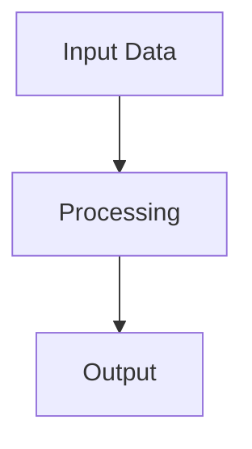

# Mermaid Diagram Skill

This skill creates diagram images from natural language descriptions or Mermaid syntax. It supports any diagram type Mermaid supports. All rendering happens locally — never use external services like mermaid.ink.

## Prerequisites

- **Node.js** (v16+) and **npx** — required to run `@mermaid-js/mermaid-cli`

Check with:

```bash
node --version && npx --version
```

If not installed, recommend:
- **macOS**: `brew install node`
- **Ubuntu/Debian**: `sudo apt install nodejs npm`
- **Windows**: Download from https://nodejs.org/

> [!NOTE]
> You do not need to install `@mermaid-js/mermaid-cli` globally. The `npx --yes` flag handles downloading it on demand.

---

## Workflow

### 1. Write the Mermaid Definition

Write the Mermaid syntax to a temporary file prefixed with `_` in the target output directory (or workspace root if no clear target exists).

- File name pattern: `_<descriptive-name>.mmd`
- Example: `_pipeline-overview.mmd`



### 2. Determine the Output Directory

Resolve where the rendered PNG should live:

- If the diagram is for a Jupyter notebook or markdown file, place the PNG in an `images/` directory relative to that document.
- If `images/` does not exist, create it.
- Name the output file descriptively (e.g., `01-pipeline-overview.png`, `architecture.png`).

### 3. Render with Mermaid CLI

Run the following command to render the diagram:

```bash
npx --yes @mermaid-js/mermaid-cli -i <input.mmd> -o <output.png> -s 3 -b white
```

Key flags:
| Flag | Purpose |
|------|---------|
| `--yes` | Auto-confirm npx package download (may not be globally installed) |
| `-i` | Input `.mmd` file path |
| `-o` | Output `.png` file path |
| `-s 3` | Scale factor 3 for high-DPI / retina output |
| `-b white` | White background for clean embedding in documents |

**Important:**
- Always use `npx --yes @mermaid-js/mermaid-cli` — never bare `mmdc`
- Never use external rendering services (mermaid.ink, kroki, etc.)
- Everything must render locally

### 4. Clean Up

Delete the temporary `_*.mmd` file after successful rendering. The `.mmd` file is disposable — the PNG is the artifact.

### 5. Return the Image Reference

Provide the relative path to the generated image so it can be embedded in the target document.

For Jupyter notebooks and markdown files:
```markdown

```

Always use a path relative to the document that references the image.

---

## Example End-to-End

Given a request to create a pipeline diagram for `docs/data-pipeline.md`:

1. Write `_pipeline-overview.mmd` to the workspace root
2. Ensure `docs/images/` exists
3. Run:
   ```bash
   npx --yes @mermaid-js/mermaid-cli -i _pipeline-overview.mmd -o docs/images/pipeline-overview.png -s 3 -b white
   ```
4. Delete `_pipeline-overview.mmd`
5. Reference in the document:
   ```markdown
   
   ```

---

## Error Handling

| Error | Cause | Fix |
|-------|-------|-----|
| `npx: command not found` | Node.js/npm not installed | Install Node.js (see Prerequisites) |
| `Could not find Chromium` | Mermaid CLI needs a browser engine for rendering | Run `npx --yes @mermaid-js/mermaid-cli` once manually to let it download Chromium, or set `PUPPETEER_EXECUTABLE_PATH` to an existing Chrome/Chromium binary |
| `Parse error on line N` | Invalid Mermaid syntax in the `.mmd` file | Review and fix the diagram definition. Check https://mermaid.js.org/syntax/ for reference |
| Render succeeds but PNG is blank | Diagram too large or empty definition | Simplify the diagram or split into multiple diagrams |
| Command hangs or times out | First run downloading `@mermaid-js/mermaid-cli` + Chromium (can take 30-60s) | Wait for initial download to complete; subsequent runs are fast |

If the render fails, **do not delete the temporary `.mmd` file** — leave it in place so the user can inspect and debug the syntax.

---

## Constraints

- **Local only.** No external HTTP rendering services.
- **Always clean up on success.** Temporary `.mmd` files must be deleted after successful rendering. Leave them on failure for debugging.
- **High-DPI default.** Always use `-s 3` unless the user explicitly requests otherwise.
- **White background default.** Always use `-b white` unless the user requests a different background.
- **Relative paths.** Image references in documents must use relative paths, never absolute.
- **Create directories.** If the target `images/` directory doesn't exist, create it before rendering.
